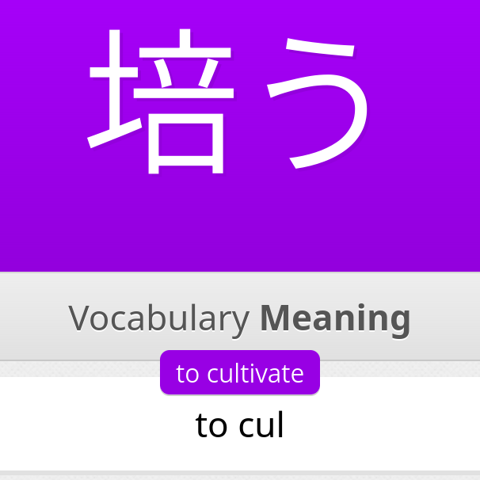
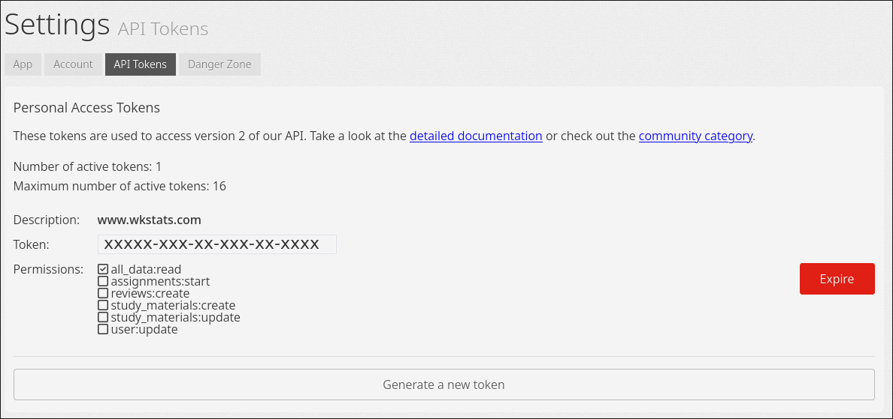
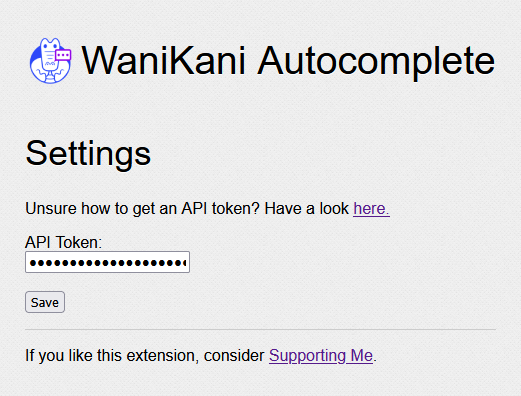

# WaniKani Autocomplete Browser Extension

Browser extension for [WaniKani](https://www.wanikani.com), which adds autocomplete functionality for English answers.

## How it works

When you start typing an answer, a suggestion will appear. Pressing the `Tab` key will then insert the suggested answer into the text field.



You can keep pressing `Tab` to cycle between all possible suggestions for what you have just typed.

**Hint:** Use `Shift+Tab` to go backwards.

## Installation

Download the extension for Firefox [here](https://addons.mozilla.org/en-US/firefox/addon/wanikani-autocomplete/?utm_source=addons.mozilla.org&utm_medium=referral&utm_content=search).

Go to [Personal Access Tokens](https://www.wanikani.com/settings/personal_access_tokens) and generate a new token. It does not need any extra permissions, so don't select any when asked to. The extension needs the API token from WaniKani to collect the possible autocomplete suggestions, and will not work without one.



Copy your newly generated token and paste it into the extension's settings.



## Development

For Firefox, go to [about:debugging](about:debugging), and select "Load Temporary Add-on...". Then select [manifest.json](src/manifest.json) as the addon.

### Distribution

To package the extension run:

```bash
. build.sh
```
